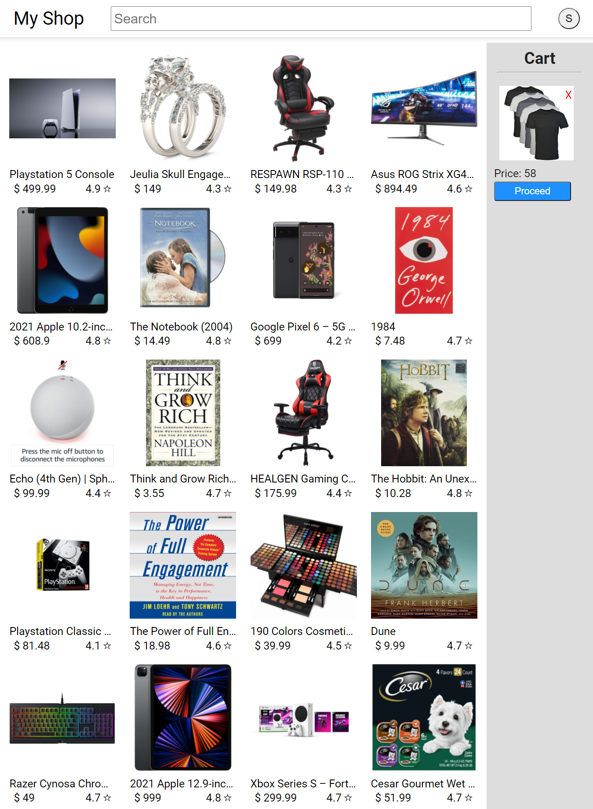
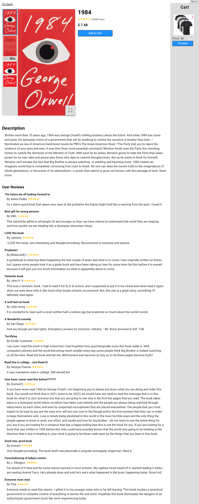

# MyShop
### eCommerce app built with ReactJS.
### Work in progress.

 

## TechStacks used :

### &nbsp;&nbsp; Next JS
- React + Server Side Rendering, Routing etc.
### &nbsp;&nbsp; API used
- Strapi(Backend), Stripe(Payment).
### &nbsp;&nbsp; State management
- Reducer + Context + State

 

More

#### Hooks used
- useReduce(Redux like), useContext, useState, useEffect.
#### Custom Hooks used
- useFetch.
#### API caller
- Axios, Fetch.
#### Styling
- CSS - modules per file.

  <!-- HOC, portals, react render (Check out 1tab) -->

<!-- Follow D:/Sh.../How to Get a Job as a ReactJS Developer in 2021.txt -->
<!--   -->

---

### Images
 

<!--  -->
#### Home

#### Selected Product

<!-- #### Payment/Stripe page -->
<!-- #### Login page -->
