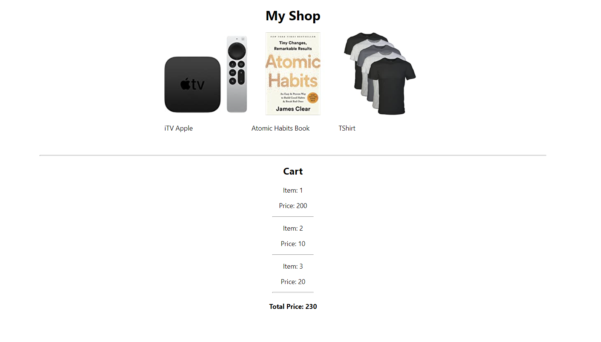
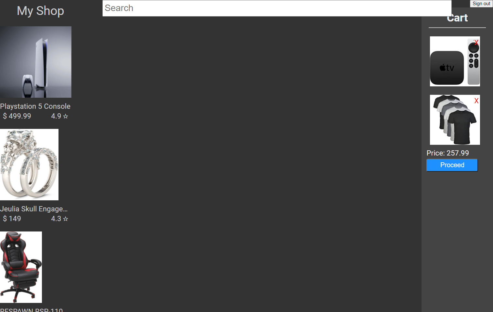
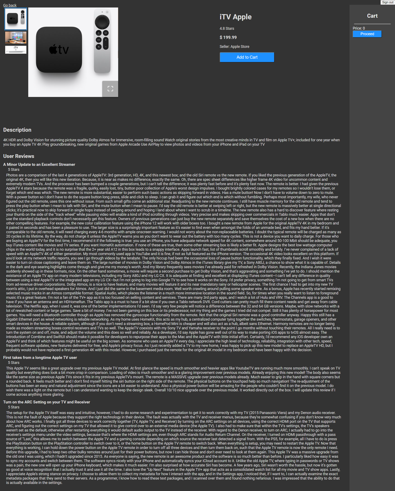

# MyShop
### eCommerce app built with ReactJS [Work in progress].

 

## TechStacks used :

### &nbsp;&nbsp; Next JS
#### &nbsp;&nbsp;&nbsp;&nbsp;&nbsp;&nbsp;&nbsp;&nbsp;&nbsp;React + Server Side Rendering, Routing etc.
### &nbsp;&nbsp; API used
#### &nbsp;&nbsp;&nbsp;&nbsp;&nbsp;&nbsp;&nbsp;&nbsp;&nbsp;Strapi(Backend), Stripe(Payment).
### &nbsp;&nbsp; State management
#### &nbsp;&nbsp;&nbsp;&nbsp;&nbsp;&nbsp;&nbsp;&nbsp;&nbsp;Reducer + Context + State

 

More

#### Hooks used
&nbsp;&nbsp;&nbsp;useReduce(Redux like), useContext, useState, useEffect.
#### Custom Hooks used
&nbsp;&nbsp;&nbsp;useFetch.
#### API caller
&nbsp;&nbsp;&nbsp;Axios, Fetch.
#### Styling
&nbsp;&nbsp;&nbsp;CSS - modules per file.

  <!-- HOC, portals, react render (Check out 1tab) -->
  

<!-- Follow D:/Sh.../How to Get a Job as a ReactJS Developer in 2021.txt -->
<!--   -->

---

### Images
 

<!--  -->
#### Home

#### Selected Product

<!-- #### Payment/Stripe page -->
<!-- #### Login page -->
