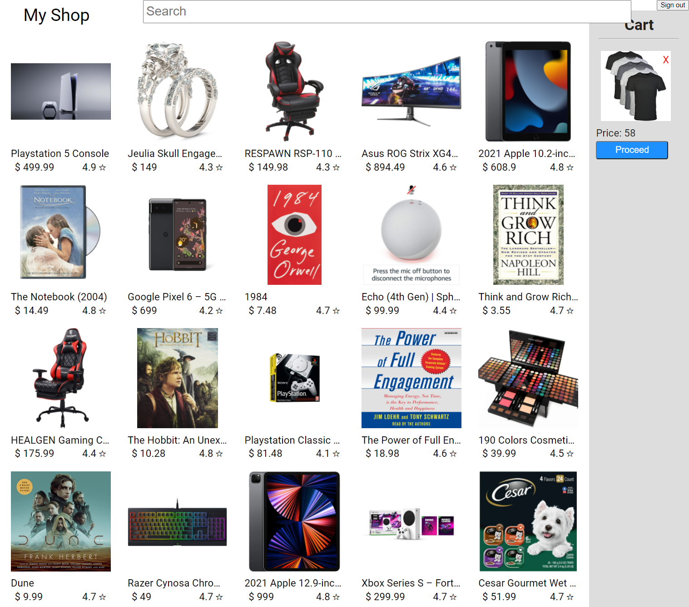

# MyShop - an eCommerce app to buy all sorts of products, built with ReactJS.

  

&nbsp;&nbsp;&nbsp;&nbsp;&nbsp;&nbsp;&nbsp;&nbsp;TechStacks used:

 

#### Next JS
&nbsp;&nbsp;&nbsp;**React + Server Side Rendering, Routing etc.**
#### API used
&nbsp;&nbsp;&nbsp;**Strapi(Backend), Stripe(Payment).**
#### State management
&nbsp;&nbsp;&nbsp;**Reducer + Context + State**
 
#### Hooks used
&nbsp;&nbsp;&nbsp;useReduce(Redux like), useContext, useState, useEffect.
#### Custom Hooks used
&nbsp;&nbsp;&nbsp;useFetch.
#### API caller
&nbsp;&nbsp;&nbsp;Axios, Fetch.
#### Styling
&nbsp;&nbsp;&nbsp;CSS - modules per file.

  <!-- HOC, portals, react render (Check out 1tab) -->

<!-- Follow D:/Sh.../How to Get a Job as a ReactJS Developer in 2021.txt -->
   

---

###Images
 

<!--  -->
#### All Products

---

#### Selected Product
